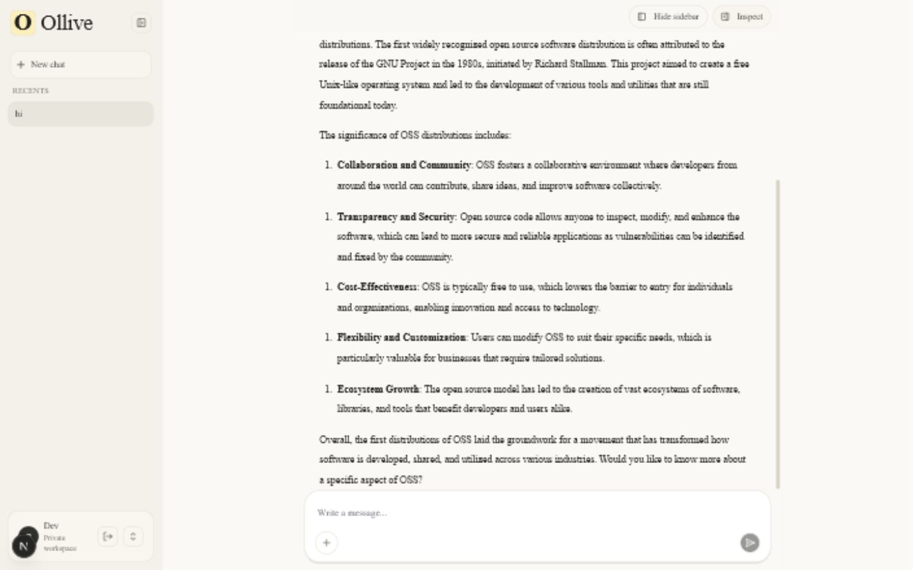
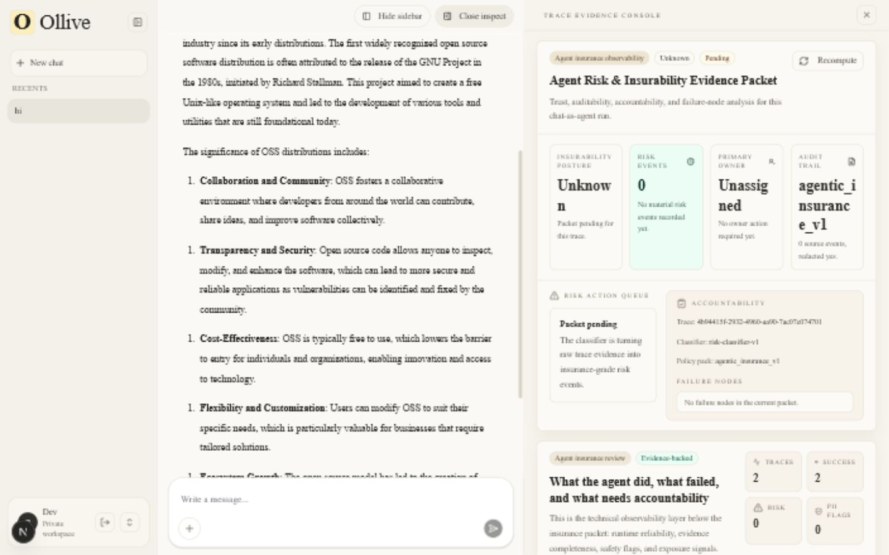
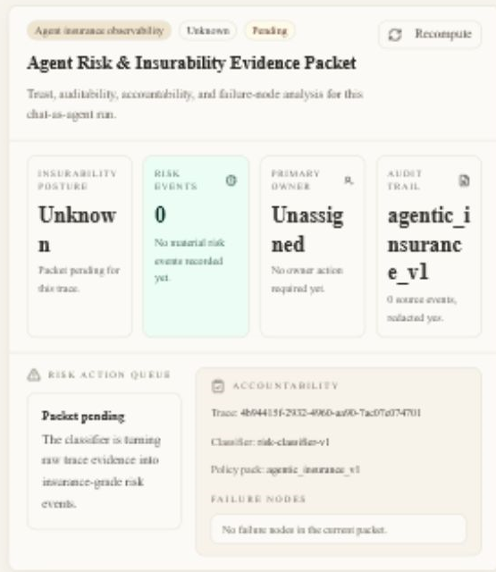

# Ollive

Ollive is becoming the open-source risk layer for AI-agent observability.

Today, it ships as an agentic insurance observability MVP for chat-as-agent workflows. It treats every chat run as an agent action, records the runtime trace, and turns that evidence into an Agent Risk & Insurability Evidence Packet.

The product thesis is simple: teams deploying AI agents in high-accountability workflows need more than token counts and latency charts. They need evidence of trust, auditability, accountability, authority boundaries, failure nodes, and remediation ownership.

Hosted demo: [ollive-insure.vercel.app](https://ollive-insure.vercel.app/)

## What It Does

Current shipped MVP:

- Streams multi-turn chat through a FastAPI backend and OpenAI-compatible wrapper.
- Persists conversations, messages, traces, trace events, inference logs, and extracted metadata in Postgres.
- Shows live inspection for request lifecycle, latency, token/cost evidence, raw request/response payloads, and event timelines.
- Generates an Agent Risk & Insurability Evidence Packet for a selected trace.
- Classifies agentic risk with the `agentic_insurance_v1` policy pack.
- Flags risky promises, coverage/regulated advice, PII exposure, missed escalation, unsupported claims, unsafe suggestions, runtime failure nodes, and authority boundary breaches.
- Assigns owner and remediation for each risk event.
- Renders chat messages as rich Markdown instead of raw Markdown text.
- Runs locally with Docker Compose, including the web app, API, Postgres, Redis, and enrichment worker.

Milestone 1 target direction:

- `AgentRun` becomes the canonical observability object.
- Chat is the first example integration, not the long-term product boundary.
- External agent SDKs, JSON ingest, LangSmith import, and OpenTelemetry import should all normalize into the same run model.
- Evidence packets should be generated from normalized agent evidence and should call out missing evidence instead of pretending unknown runs are safe.

## Screenshots

### Chat Workspace



### Trace Evidence Console



### Agent Risk & Insurability Evidence Packet



## Local Setup

1. Copy the example environment file.

   ```bash
   cp .env.example .env
   ```

2. Set `OPENAI_API_KEY` in `.env` if you want real model responses. Without it, the backend returns a stubbed streaming response so the app still runs.

3. Start the full local stack.

   ```bash
   docker compose up -d --build
   ```

4. Open the app.

   - Web: [http://localhost:3000](http://localhost:3000)
   - API health: [http://localhost:8001/health](http://localhost:8001/health)
   - API docs: [http://localhost:8001/docs](http://localhost:8001/docs)

The Docker setup enables local auth bypass by default with `AUTH_BYPASS=true` and `NEXT_PUBLIC_AUTH_BYPASS=true`. For shared or production-like environments, disable bypass and set a real `AUTH_INVITE_CODE` plus a long random `AUTH_SESSION_SECRET`.

## Demo Flow

1. Start a new chat and send a few representative prompts.
2. Open the Inspect panel.
3. Select a trace from the trace evidence console.
4. Review the live trace details and event timeline.
5. Open the evidence packet tab to see insurability posture, risk events, owner, remediation, audit trail, and failure nodes.
6. Use Recompute after a trace changes or after backfilling trace events.

## Core Endpoints

- `POST /api/auth/invite` - create a local session from an invite code.
- `GET /api/auth/session` - read the current session.
- `POST /api/conversations` - create a conversation.
- `GET /api/conversations` - list conversations.
- `GET /api/conversations/{id}` - get conversation detail and messages.
- `POST /api/conversations/{id}/messages/stream` - stream a chat response and write trace evidence.
- `POST /api/conversations/{id}/cancel` - cancel or pause an active conversation.
- `POST /api/ingest/logs` - accept SDK-style inference logs.
- `GET /api/metrics/overview` - read dashboard metrics.
- `GET /api/traces` - list traces.
- `GET /api/traces/{trace_id}` - read trace detail.
- `GET /api/traces/{trace_id}/events/stream` - stream trace events.
- `GET /api/traces/{trace_id}/evidence-packet` - read or lazily generate an evidence packet.
- `POST /api/traces/{trace_id}/evidence-packet/recompute` - recompute risk events and packet summary.
- `POST /v1/runs` - ingest a normalized AgentRun JSON payload and generate a run-level evidence packet.
- `GET /v1/runs` - list normalized agent runs.
- `GET /v1/runs/{run_id}` - read one normalized agent run with steps and sources.
- `POST /v1/runs/{run_id}/events` - append AgentRun steps and recompute the evidence packet.
- `GET /v1/runs/{run_id}/evidence-packet` - read a run-level evidence packet.
- `POST /v1/runs/{run_id}/evidence-packet/recompute` - recompute a run-level evidence packet.

## Architecture

Ollive is a small monorepo:

- `apps/web` - Next.js app router UI for chat, auth, and inspect views.
- `apps/api` - FastAPI service for auth, chat streaming, ingestion, metrics, traces, and evidence packets.
- `packages/llm_sdk` - OpenAI streaming wrapper and non-blocking ingestion helper.
- `packages/shared` - redaction utilities and shared helpers.
- `packages/database` - SQL schema and database notes.
- `packages/worker` - Redis enrichment worker for metadata extraction.
- `docs` - architecture, product, schema, tradeoff, and readiness notes.

The current trace flow is:

```text
chat request
  -> FastAPI stream endpoint
  -> OpenAI wrapper or stubbed stream
  -> messages + traces + trace_events + inference_logs
  -> evidence packet scheduler
  -> risk classifier
  -> agent_risk_events + evidence_packets
  -> inspect UI
```

The target OSS risk-layer flow is:

```text
agent app
  -> Ollive SDK / adapter / JSON ingest
  -> collector API
  -> normalized AgentRun
  -> risk engine
  -> evidence packet
  -> dashboard / export / review
```

No Ollive-hosted service should be required. LangSmith, OpenTelemetry, custom logs, and the current chat path are inputs to the risk layer, not hard dependencies.

Read more:

- [Architecture notes](./ARCHITECTURE_NOTES.md)
- [System architecture](./docs/architecture.md)
- [Agentic insurance observability](./docs/agentic-insurance-observability.md)
- [OSS risk layer product thesis](./docs/product/oss-risk-layer.md)
- [Agent risk layer architecture](./docs/architecture/agent-risk-layer.md)
- [AgentRun schema](./docs/architecture/agent-run-schema.md)
- [JSON AgentRun ingest](./docs/integrations/json-ingest.md)
- [OSS milestone roadmap](./docs/roadmap/oss-milestones.md)
- [Schema notes](./docs/schema.md)
- [Tradeoffs](./docs/tradeoffs.md)
- [Ship readiness](./docs/ship-readiness.md)

## Database Tables

- `users` - invite/session identity plus local LLM call counts.
- `conversations` - chat threads.
- `messages` - user and assistant turns.
- `traces` - request-level runtime telemetry.
- `trace_events` - lifecycle and streaming events for a trace.
- `inference_logs` - SDK-friendly request logs.
- `extracted_metadata` - worker-extracted key/value metadata.
- `agent_policy_rules` - the active insurance risk policy pack.
- `agent_risk_events` - trace-level risk findings with severity, owner, evidence, and remediation.
- `evidence_packets` - packet status, insurability posture, summary, audit trail, and failure nodes.
- `memories` - optional future memory layer.

## Verification

Useful checks before pushing:

```bash
python -m py_compile apps/api/app/auth.py apps/api/app/db.py apps/api/app/routes.py apps/api/app/trace_runtime.py apps/api/app/risk_classifier.py
```

```bash
cd apps/web
npx tsc --noEmit --pretty false
```

```bash
cd apps/web
npx eslint components/chat/markdown-message.tsx components/chat/assistant-message.tsx components/chat/user-message.tsx components/chat/chat-layout.tsx components/inspect/inspect-panel.tsx components/inspect/inspect-tabs.tsx components/inspect/evidence-packet.tsx components/inspect/ops-review.tsx components/auth/auth-gate.tsx app/lib/api.ts app/lib/auth.ts
```

```bash
git diff --check
docker compose ps
```

## Shipping Position

You can call this an observability tool now, but be precise: it is an agentic insurance observability MVP for chat-as-agent workflows. It has real trace capture, persistence, risk classification, evidence packets, and an inspect UI.

The strategic direction is stronger:

> Ollive is the open-source risk layer for AI-agent observability.

Do not call it a production LangSmith replacement. Ollive should be independent of LangSmith and similar tools: it can ingest from them, but its differentiated job is risk interpretation, evidence packets, and accountability. Before production, it still needs external SDK ingestion, a collector API, multi-tenant controls, retention policy, alerting, evals, review workflows, stronger test coverage, and deploy hardening. See [ship readiness](./docs/ship-readiness.md).
